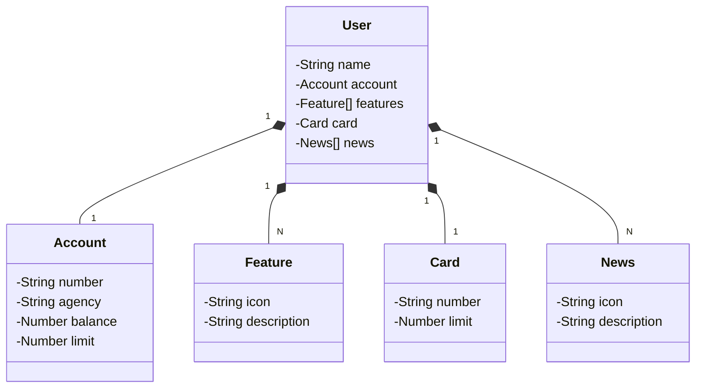

# java-sdw-api
Desafio DIO:  API REST usando Java.

---

## Tecnologias Utilizadas

- **Java 20**: Java 20 é a versão mais recente do Java, lançada em 21 de março de 2023, que inclui propostas de melhoria para o JDK;
 - **Spring Boot 3**: Que auxilia na produtividade e fornece ferramentas de autoconfiguração;
 - **Spring Data JPA**: Para simplificar o acesso ao banco de dados;
 - **OpenAPI (Swagger)**: Fornece uma documentação para API;

## [Link do Figma](https://www.figma.com/file/0ZsjwjsYlYd3timxqMWlbj/SANTANDER---Projeto-Web%2FMobile?type=design&node-id=1421%3A432&mode=design&t=6dPQuerScEQH0zAn-1)

O Figma disponibilizado pela DIO para a análise e projeto da solução.

## Diagrama de Classes

